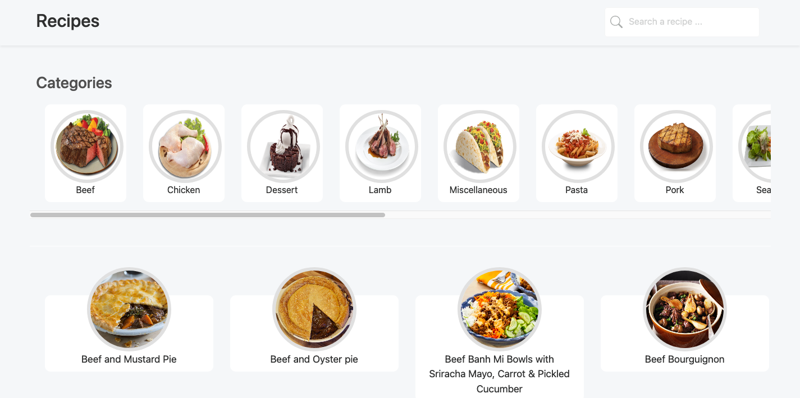
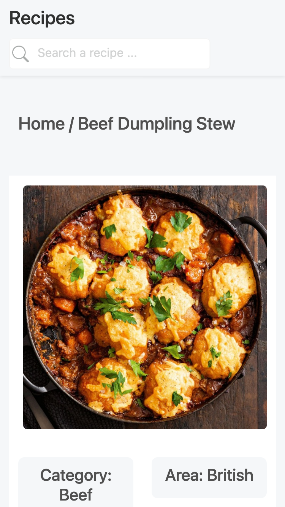
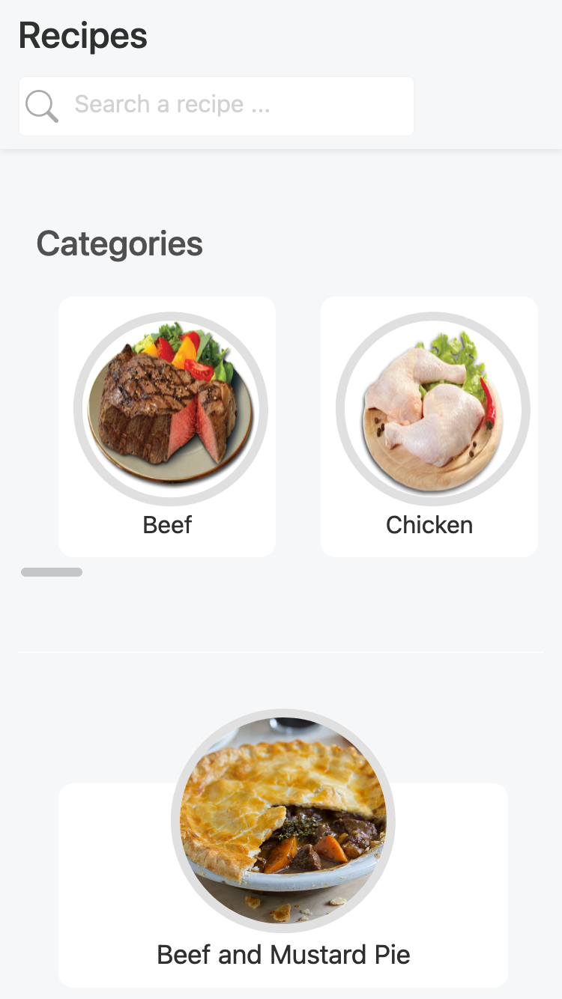

# Recipes


<p>


</p>
<br />

## Getting Started

First, run the development server:

```bash
npm run dev
# or
yarn dev
```

---

# Notes

Next.js has support for API Routes, which let you easily create an API endpoint as a Node.js serverless function

```
EX:
http://localhost:3000/api/...
```

# Config

File '/services/api'

# URL WEB

https://recipes-next-js.vercel.app/

Deploy with vercel and automatically deploys

# Test

```bash
yarn test
# and
yarn coverage
```

Acess the file -> ROOT_DIR /coverage/lcov-report/index.html in browser
